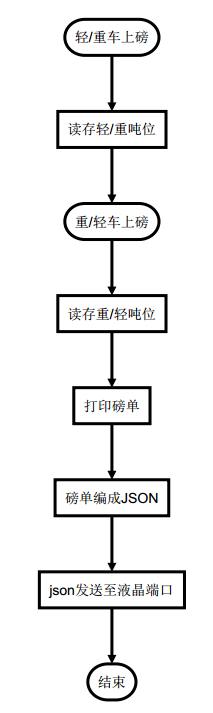

# 赋隆磅房系统二维码定制说明

## 一、需求描述
当车辆经过2次称重后，并打印磅单时，把纸质磅单的数据字段组成JSON字符串。
并把JSON字符串转成二维码，并输出到LED屏幕。

## 二、二维码触发流程


## 三、液晶端口
+ 端口位于打印磅单的本地机
+ 请求方式为HTTP协议
+ 请求方式为POST请求
+ 地址和端口为`http://localhost:8989`

## 四、字段规范
请求内容为无换行的`json`字符串，具体字段说明见下节。
### 4.1 轻车装煤磅单字段
**注意键全是大写**
```json
{
    "A": "瘦煤", //煤种
    "B": "李虎", // 重车过磅员
    "C": "79.01", // 重车吨数
    "D": "2019-12-19 10:49:26",// 重车过磅时间
    "E": "2019-12-19 10:45:11",// 轻车过磅时间
    "F": "1912400041", // 磅单编号
    "G": "陕K60668", // 车牌号
    "H": "大卡车", // 车型
    "I": "张龙", // 轻车过磅员
    "J": "30.09", // 轻车吨位
}
```

### 4.2 重车卸煤字段
```json
{
    "K": "陕K60668", //车牌号
    "L": "79.01", // 重车吨位
    "M": "瘦煤", // 煤种
    "N": "张三", // 重车过磅员
    "O": "2019-12-19 10:49:26", // 重车过磅时间
    "P": "30.09", // 轻车吨数
    "Q": "1912400041", // 磅单编号
    "R": "大卡车", // 车型
    "S": "李明", // 轻车过磅员 
    "T": "2019-12-19 10:49:26", // 轻车过磅时间
    "U": "49.81", // 矿发吨数
}
```


## 五、调用示例
网页引入我方封装后的jQuery.led插件,即`led.js`后,调用`jQuery.led`对象的相关方法,如下:
```js
$.led({k1:v1,k2:v2...kn:vn},privateKey); 
```
仅需如上一行,即可完成二维码生成。

其中：`privateKey`是对二维码进行签名，并生成签名字段，防止字段内容被篡改。
此处，需要双方共同制定私钥表，以保持一致。

## 六、附录-签名规范
为防止`json`字符串被恶意篡改，需要加入`signature`签名字段，这个字段在`led`插件里已经自动封装，除非你要做更深入的开发，否则不必管。

具体规则为：
1. `json`对象`key/value`按`key`升序排列
2. 并按`k1v1k2v2..knvn`拼接字符串
3. 上步中字符串再拼接密钥，例`privateKey`
4. 最终拼接结果为`k1v1k2v2..knvnprivateKey`
5. 对最终结果计算`md5`值，假设为`signString`
6. `json`对象添加`signature`字段，值为`signString`

### 6.1 签名程序
```js
function sign(obj , pk) {
    var keys = [], len=0 , kv='';

    for (var k in obj) {
      if (obj.hasOwnProperty(k)) {
        keys.push(k);
      }
    }

    keys.sort();

    len = keys.length;

    for (var i = 0; i < len; i++) {
       k = keys[i];
       kv = kv+k+obj[k];
    }
    // 自行引入jQuery.md5插件
    //https://github.com/placemarker/jQuery-MD5
    return jQuery.md5(kv+pk).toUpperCase().substr(0,6);
}

// 测试用例:
var myObj = {'aa':'vaa',
'h':'vhh',
'b':'vbb',
'ad':'vad',
'signature':'DE35A4'};

var postsign = myObj.signature;
delete myObj.signature;

console.log(sign(myObj,'jdlku95ets')===postsign); // True
```

```php
function sign($arr , $privateKey) {
    ksort($arr);
    $kv = '';
    foreach($arr as $k=>$v) {
      $kv = $kv.$k.$v;
    }

    return substr(strtoupper(md5($kv.$privateKey)),0,6);
}

// 测试用例:
$arr = ['aa'=>'vaa',
'b'=>'vbb',
'h'=>'vhh',
'ad'=>'vad',
'signature'=>'DE35A4 '];

$pk = 'jdlku95ets';

$signature = $arr['signature'];
unset($arr['signature']);

var_dump($arr , $privateKey) === $signature);

```